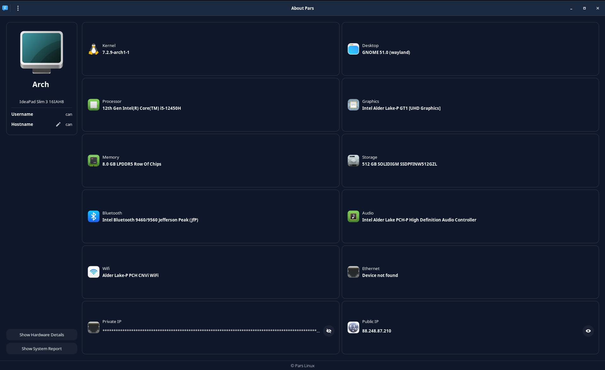
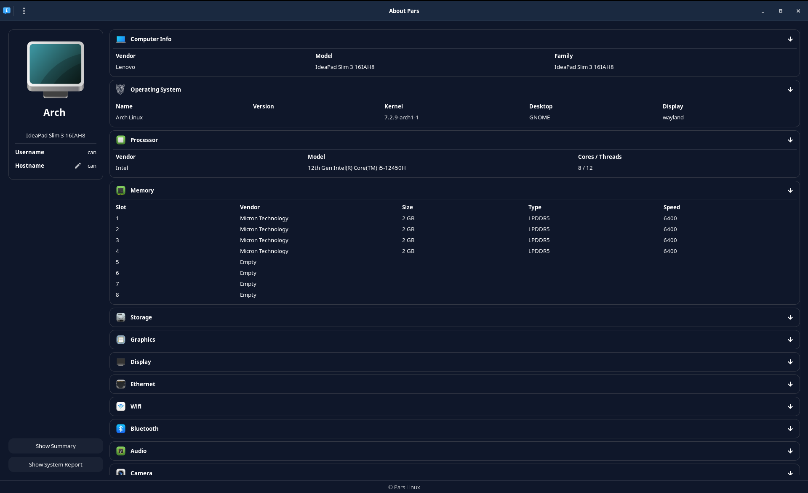
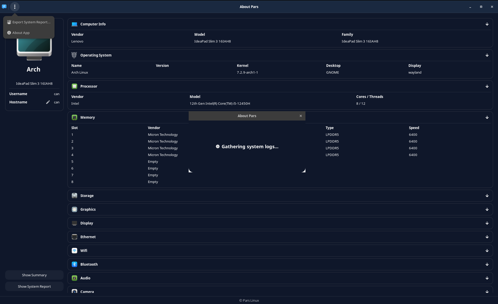

# Pars About

Pars About is an application that show summary information about the PC.

It is currently a work in progress. Maintenance is done by Pars team.

[](https://repology.org/project/pars-about/versions)


### **Screenshots**







### **Dependencies**

This application is developed based on Python3 and GTK+ 3. Dependencies:
```bash
gir1.2-glib-2.0 gir1.2-gtk-3.0 python3-requests python3-gi lsb-release mesa-utils pciutils
```

### **Run Application from Source**

Install dependencies
```bash
sudo apt install gir1.2-glib-2.0 gir1.2-gtk-3.0 python3-requests python3-gi lsb-release mesa-utils pciutils
```
Clone the repository
```bash
git clone https://github.com/parslinux/Pars-About.git ~/pars-about
```
Run application
```bash
python3 ~/pars-about/src/Main.py
```

### **Build deb package**

```bash
sudo apt install devscripts git-buildpackage
sudo mk-build-deps -ir
gbp buildpackage --git-export-dir=/tmp/build/pars-about -us -uc
```


--------------------------------------
<br>

## **Pars Python GTK Coding Rules**

* Project structures must be this project
* Python codes must be compatible with pep8 rules. For this you can use pylint, pyflakes etc.
* When you create variable it must use underscore style. For example "package_size = 30". Dont use short name in variables like "pkg_sz = 30".
* GTK Widget IDs must be like this "ui_mybutton_togglebutton" on everywhere(Python, Glade).
* If you really have no other choice, you should prefer standard libraries when writing code. For example don't write a config parser for yourself, because python already have a config parser library.# pars-about-
